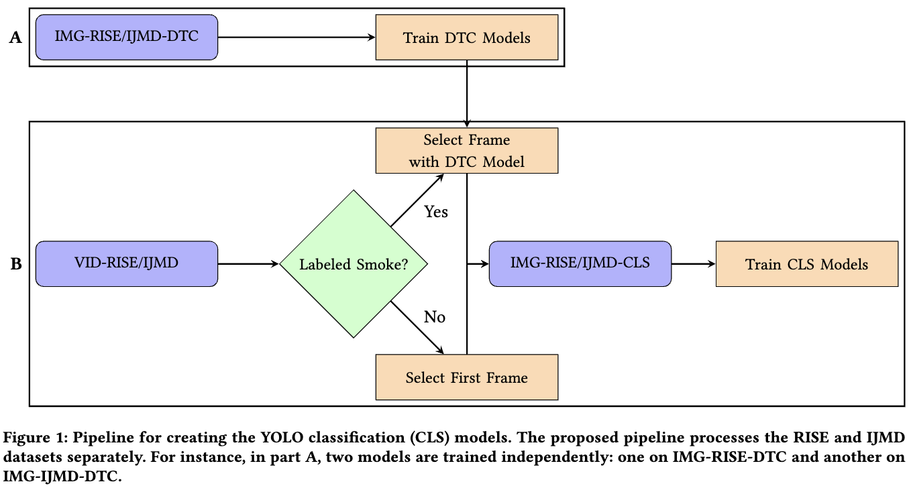

# Using RGB-I3D

For using the RGB-I3D model, we refer to the steps defined in [Project RISE](https://github.com/CMU-CREATE-Lab/deep-smoke-machine). However, in this repository we have made a slight adjustment to the i3d_learner file. Therefore, when running code for IJmond the ```i3d_learner_ijmond.py``` file is used. Also, we refer to this repo for downloading the necessary videos and RGB-I3D models used in this research. 

# Using YOLO

This image represents the pipeline that was used in this research. We refer to the paper to get a better understanding of the exect workings. 

<p align='center'>
  
</p>

## 1.1 Train Detection Model
To train the detection model, used for creating the image datasets from the video datasets, take the following steps:
```
cd YOLOv8/scripts
python3 train_detection.py [rise/ijmond]
```
Calling the file requires the user to either select rise or ijmond, indicating for which dataset you want to train the detection model. It is important that you have already downloaded the annotated datasets LINK HERE and placed them in either ```../data/[rise/ijmond]/annotated```. In the ```train_detection.py``` file itself, you can change the hyperparameters of the training setup. The model should automatically detect if GPUs are available. If you want to train differently, I refer to the following site [YOLO DOCS](https://docs.ultralytics.com/modes/train/). The best model will be saved in ```../data/saved_models/detection_[rise/ijmond].pt```. 

## 1.2 Select Frames
Using the detection model, you are now able to select frames from the videos. Run the ```python3 select_frames.py [rise/ijmond].py``` file to create an image dataset from either the rise or ijmond video datasets. In the last line of the output, you will be able to see for how many positively labeled videos the model failed to select a frame containing smoke. For these videos, the middle frame is selected to contain smoke, as discussed in the paper.

## 1.3 Setup Baselines
Following the paper, we need to create six baseline models for YOLO, one trained on each split from the RISE data.

### 1.3.1 Create Image Data Splits
The YOLO model requires a specific data structure, therefore we need to create data splits like this:
```
split_1/
  train/
    positive/
      img1.jpg
      img2.jpg
      ...
    negative/
      img1.jpg
      img2.jpg
      ...
  test/
    ...
  val/
    ...
```

The splits are defined in the ```../data/rise/splits``` directory and are from [Project RISE](https://github.com/CMU-CREATE-Lab/deep-smoke-machine). Simply run ```python3 create_splits.py``` to create the image splits for rise. 

### 1.3.2 Train Baselines
To train the six YOLO baseline models, simply run ```python3 train_baselines.py```. The models will be saved under ```../data/saved_models/0-shot/...```. There will be a total of six baseline models, representing the six RISE data splits. Again, if you wish to change the hyperparameters for training, go to the file directly. 

## 1.4 Run Experiments
Now that everything is setup, we can run the experiments on the IJmond data for each learning technique. As stated in the paper, for each learning technique, we also create five unique data splits. This is done in a same way as in 1.3.1, but the folders are automatically created and removed again. Simply run ```python3 experiments.py [0-shot/1-shot/3-shot/6-shot/9-shot]``` to fine-tune the six baselines on the specified n-shot setup (when you enter 0-shot there will be no finetuning, but only testing).